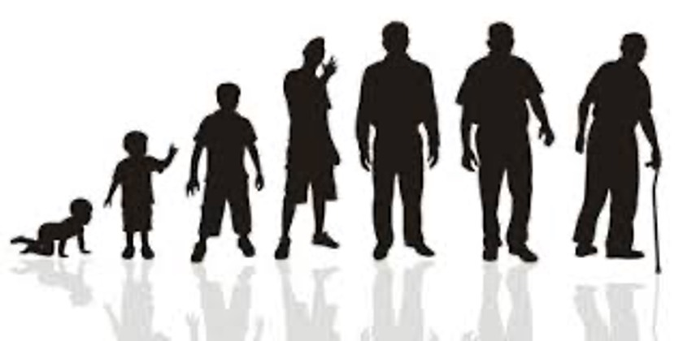
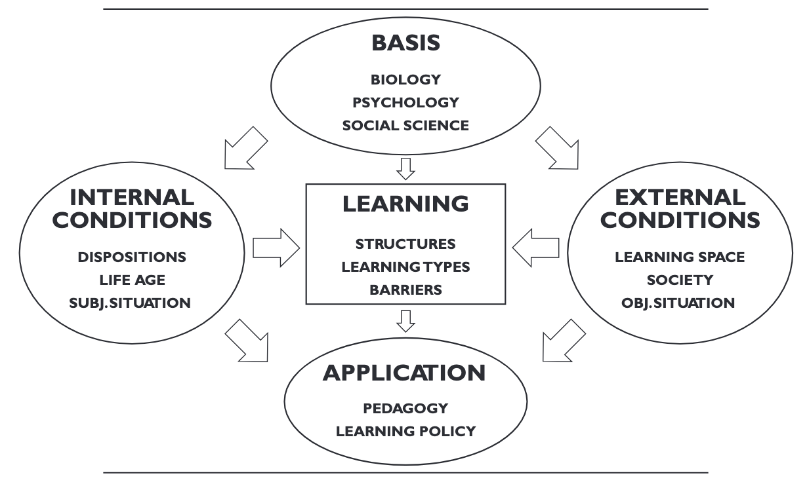
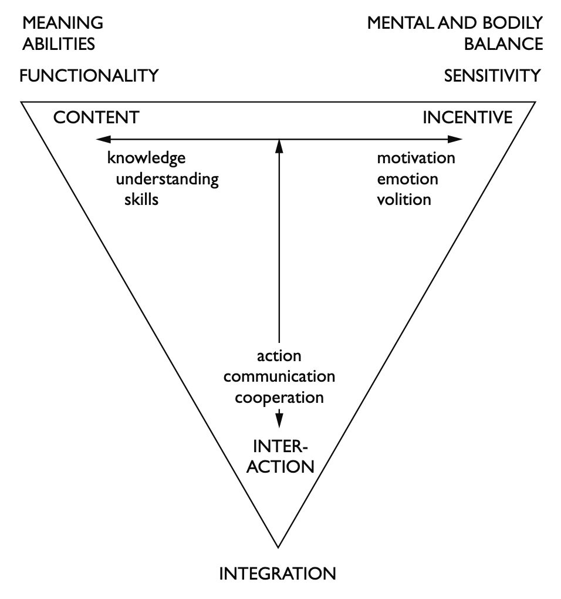
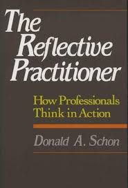
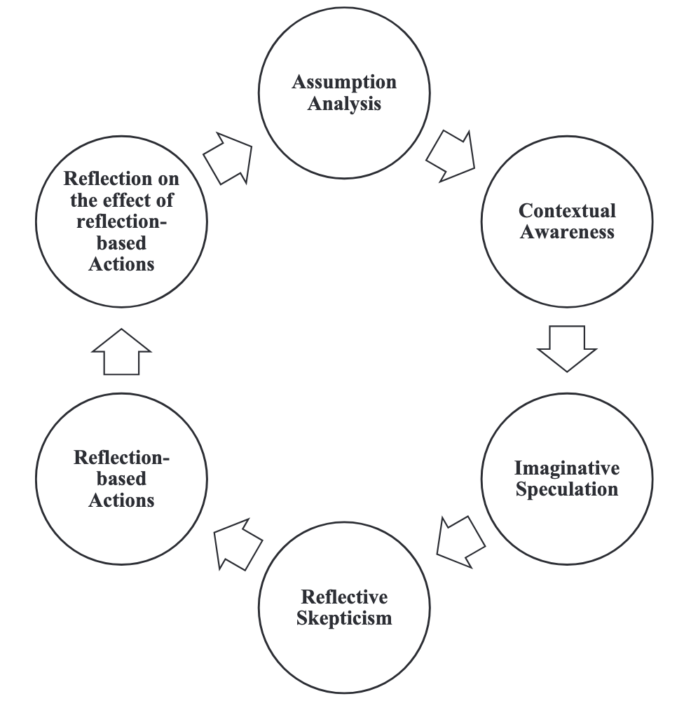

# Transformationen in Transitionen
  
*Entwicklungs- und lerntheoretischer Blick auf Transitionen*
  
Dr. Christof Nägele · Uni Basel & PH FHNW

::: {.links}
[ADAM](hhttps://adam.unibas.ch/go/crs/2097884). 
[Programm](https://drive.switch.ch/index.php/s/y5eDSTL2EMkoXg5)
:::

# TERMIN 1
Einführung

# Lernen und Entwicklung
  
Wie kann man Jugendliche oder junge Erwachsene in Transitionen am besten unterstützen, mit Fokus auf Lernen und Entwicklung?

# Laufbahn Biographie

Sicher ist, dass es zunehmend mehr darauf ankommt, dass jeder Mensch seine eigene Biographie sowohl im persönlichen und sozialen als auch im beruflichen Bereich gestalten und steuern kann.

Allerdings kommt es heute darauf an, diesen Prozess nicht nur von seinem Ergebnis her zu sehen. 
Viel wichtiger ist, ihn selbst als eine persönliche Entwicklungschance zu begreifen und pädagogisch zu nutzen. 

::: {.source }
Eckert, M. (2008). Defizite in der Berufsvorbereitung—Was ist ein gelingender Übergang von der Schule in den Beruf? In E. Schlemmer & H. Gerstberger (Eds), Ausbildungsfähigkeit im Spannungsfeld zwischen Wissenschaft, Politik und Praxis (pp. 149–159). VS Verlag für Sozialwissenschaften.
:::

# Laufbahn Karriere

- *career as life process*  
Career is about an ongoing process that accompanies the person’s entire life. 

- *career as individual agency*   
If career is recognised as a life process, it is vital to identify and understand the human participation in this process. 

- *career as meaning making*  
one’s life career development means a very complex and dynamic person-in-context process. 

# Begriffe

{width=100%}

# Definitionen

- Transitionen
- Transformationen    
- Entwicklung
- Reifung
- Lernen

# Entwicklung

Unter Entwicklung versteht man im Allgemeinen einen Prozess der Entstehung, der Veränderung bzw. des Vergehens, wobei drei Prinzipien zu Grunde liegen: das Prinzip des Wachstums, das Prinzip der Reifung und das Prinzip des Lernens.

::: {.source }
Stangl, W. (2021). Stichwort: Entwicklung. Online Lexikon für Psychologie und Pädagogik. https://lexikon.stangl.eu/12182/entwicklung (2021-03-02)
:::

# Reifung

Als Reifung Vorgänge klassifiziert, die aufgrund endogen vorprogrammierter und innengesteuerter Wachstumsprozesse einsetzen und auch im weiteren Verlauf größtenteils von diesen gesteuert werden. Alle Vorgänge der Reifung sind letztlich durch Vererbung determiniert, wobei exogene Faktoren wenig bis gar keinen Einfluss auf die Reifung ausüben. 

::: {.source }
Stangl, W. (2021). Stichwort: Reifung. Online Lexikon für Psychologie und Pädagogik. https://lexikon.stangl.eu/1842/reifung#comments (2021-03-02)
:::

# Entwicklung: Life-Designing

Individuals in the knowledge societies at the beginning of the 21st century must realize that career problems are only a piece of much broader concerns about how to live a life in a postmodern world shaped by a global economy and supported by information technology.

::: {.source }
Savickas, M. L., Nota, L., Rossier, J., Dauwalder, J.-P., Duarte, M. E., Guichard, J., Soresi, S., Van Esbroeck, R., & van Vianen, A. E. M. (2009). Life designing: A paradigm for career construction in the 21st century. Journal of Vocational Behavior, 75(3), 239–250. https://doi.org/10.1016/j.jvb.2009.04.004
:::

# Entwicklung Laufbahn

Life-designing intervention 

- Adaptability
- Narratability
- Activity
- Intentionality

::: {.source }
Savickas, M. L., Nota, L., Rossier, J., Dauwalder, J.-P., Duarte, M. E., Guichard, J., Soresi, S., Van Esbroeck, R., & van Vianen, A. E. M. (2009). Life designing: A paradigm for career construction in the 21st century. Journal of Vocational Behavior, 75(3), 239–250. https://doi.org/10.1016/j.jvb.2009.04.004
:::

# Lernen

Unter Lernen versteht man den absichtlichen oder den beiläufigen, individuellen oder kollektiven Erwerb von geistigen, körperlichen, sozialen Kenntnissen, Fähigkeiten und Fertigkeiten. 
Lernen bedeutet, die Zukunft vorhersagen zu können und das Verhalten dementsprechend anzupassen. 

::: {.source } 
Stangl, W. (2021). Stichwort: Lernen. Online Lexikon für Psychologie und Pädagogik. https://lexikon.stangl.eu/551/lernen/ (2021-03-02)
:::

# Arten des Lernens

- Kumulation - Dressur
- Assimilation – additives Lernen
- Akkomodation – ausweitendes Lernen, neues Verständnis, neues Verhalten
- Transformatives Lernen

::: {.links }
Illeris, K. (2008). Lernen umfassend verstehen. In 26° Curso Seminario Internacional de Estudios sobre la Formación Profesional y la Enseñanza en el Sector de la Agricultura(August). 
:::

# Struktur Lerntheorie

{width=100%}

::: {.source }
Illeris, K. (2009). A comprehensive understanding of human learning. In K. Illeris (Ed.), Contemporary theories of learning: Learning theorists ... In their own words (pp. 7–20). Routledge.
:::

# Zwei Grundprozesse

1. Externen Interaktion zwischen Lernenden und der sozialen, kulturellen und materiellen Umgebung.  
2. Interner psychologischen Prozess der Erarbeitung und Aneignung, bei dem neue Impulse mit den Ergebnissen von vorher erworbenen Kenntnissen verknüpft werden.

::: {.source}
Illeris, K. (2008). Lernen umfassend verstehen. In 26° Curso Seminario Internacional de Estudios sobre la Formación Profesional y la Enseñanza en el Sector de la Agricultura(August). 
:::

# Lernen drei Dimensionen

{width=100%}

::: {.source }
Illeris, K. (2009). A comprehensive understanding of human learning. In K. Illeris (Ed.), Contemporary theories of learning: Learning theorists ... In their own words (pp. 7–20). Routledge.
:::

# Lernen drei Dimensionen

Inhaltliche Dimension von Wissen, Verstehen, Fähigkeiten, Können, Verhaltensweisen, Arbeitsmethoden, Werten etc.   
Emotionale Dimension von Gefühlen, Motivation und Wollen.   
Soziale Dimension von Interaktion, Kommunikation und Kooperation – die alle in einen gesellschaftlichen Kontext eingebettet sind. 

::: {.source }
Illeris, K. (2008). Lernen umfassend verstehen. In 26° Curso Seminario Internacional de Estudios sobre la Formación Profesional y la Enseñanza en el Sector de la Agricultura(August). 
:::

# Wann und wo lernen wir?

- Informell – Formal 
- Implizit - Explizit

# Theorie oder Tun?

Throughout most of history, teaching and learning have been based on apprenticeship. 
Children learned how to speak, grow crops, construct furniture, and make clothes. 
But they didn't go to school to learn these things; instead, adults in their family and in their communities showed them how, and helped them do it…

::: {.source }
Collins, A. (2006). Cognitive apprenticeship. In K. R. Sawyer (Ed.), The cambridge handbook of the learning sciences. Cambridge University Press.
:::

# Learning in activity

The defining characteristic of a situative approach is that instead of focusing on individual learners, the main focus of analysis is on activity systems: complex social organizations containing learners, teachers, curriculum materials, software tools, and the physical environment.   
From the situative perspective, all socially organized activities provide opportunities for learning to occur, including learning that is different from what a teacher or designer might wish. 

::: {.source }
Greeno, J. G. (2006). Learning in activity. In K. R. Sawyer (Ed.), The cambridge handbook of the learning sciences. Cambridge University Press. 
:::

# Reflexion

{width=100%}

# Reflection

- Reflection-on-action (taking place a posteriori, when the task is already accomplished) 
- Reflection-in-action (occurring while performing the task) are equally important to increasing one’s professionalism.

::: {.source }
Cattaneo, A. A. P., & Motta, E. (2021). “I reflect, therefore I am… a good professional”. On the relationship between reflection-on-action, reflection-in-action and professional performance in vocational education. Vocations and Learning, 14(2), 185–204. https://doi.org/10.1007/s12186-020-09259-9
:::

# Transformatives Lernen

Transformative learning is defined as the process by which we transform problematic frames of reference (mindsets, habits of mind, meaning perspectives) – sets of assumption and expectation – to make them more inclusive, discriminating, open, reflective and emotionally able to change.

::: {.source }
Mezirow, J. (2009). An overview on transformative learning. In K. Illeris (Ed.), Contemporary theories of learning: Learning theorists ... In their own words (pp. 90–105). Routledge.
:::

# Reflection on...

- Process
- Content
- Goal
- ...

::: {.source }
Liu, K. (2020). Critical reflection for transformative learning: Understanding e-portfolios in teacher education. Springer International Publishing. https://doi.org/10.1007/978-3-319-01955-0
:::

# Critical Reflection 

{width=100%}

::: {.source }
Liu, K. (2020). Critical reflection for transformative learning: Understanding e-portfolios in teacher education. Springer International Publishing. https://doi.org/10.1007/978-3-319-01955-0
:::

# TERMIN 2

Lektüre

Hoggan, C., Hoggan-Kloubert, T., & Kraus, K. (2026). Life transitions, daily living, and transformative learning: Insights from a migration journey. In M. Bernhard, S. Billett, C. Hof, V. J. Marsick, & P. H. Sawchuk (Eds), *Adult education in changing times* (pp. 187–202). Routledge.

Keane, M., Khupe, C., & Mpofu, V. (2022). Reflections on transformation: Stories from Southern Africa. In A. Nicolaides, S. Eschenbacher, P. T. Buergelt, Y. Gilpin-Jackson, M. Welch, & M. Misawa (Eds), *The Palgrave handbook of learning for transformation* (pp. 521–536). Springer International Publishing. https://doi.org/10.1007/978-3-030-84694-7_29 

# Leitfrage

Wie, und von wem, kann Unterstützung im Übergang von Sek I über Sek II in Erwerbsarbeit oder Tertiärbildung als lern- und entwicklungsorientierter Prozess gestaltet werden, der Reflexion, Transformation und Identitätsentwicklung ermöglicht?

# Life transitions, daily living, and transformative learning

**Reflection and introspection**

- *Critical self-reflection* 
  Critical self-reflection refers to the process of questioning one’s taken-for-granted assumptions, beliefs, and perspectives in order to enable transformative learning (Mezirow, 2000).
- *Soul work* 
  “Soul work” refers to the engagement of emotions, imagination, and inner experience in processes of meaning-making and learning (Dirkx, 2001).
- *Narrative reconstruction* 
  Narrative reconstruction refers to the process of reinterpreting and reorganising one’s life experiences into a coherent story that enables new meanings and orientations for future action (Hoggan-Kloubert, 2024).

# Transformative Learning: Ten Steps Mezirow

<table>
<tr>
<td><b>1. Trigger & Disruption</b></td>
<td>
• Disorienting dilemma 
• Self-examination (incl. emotions)  
Something disrupts existing meaning structures.
</td>
</tr>

<tr>
<td><b>2. Critical Reflection</b></td>
<td>
• Critical assessment of assumptions 
• Recognition of shared experiences  
Old perspectives are questioned and relativised.
</td>
</tr>

<tr>
<td><b>3. Exploration & Planning</b></td>
<td>
• Exploration of new roles/actions 
• Planning a course of action 
• Acquiring knowledge and skills  
New possibilities are considered and prepared.
</td>
</tr>

<tr>
<td><b>4. Experimentation</b></td>
<td>
• Trying out new roles  
New ways of being are tested in practice.
</td>
</tr>

<tr>
<td><b>5. Integration</b></td>
<td>
• Building competence and confidence 
• Reintegration with a transformed perspective  
The new perspective becomes part of everyday life.
</td>
</tr>

</table>

::: {.source}
Mezirow, J., & Associates. (2000). *Learning as transformation: Critical perspectives on a theory in progress*. Jossey-Bass Publishers.
:::

# Perspectives 

*Constructivist perspective* 
Transformative learning is seen as a process in which individuals actively construct new meanings by critically reflecting on their experiences, revising prior assumptions, and integrating new understandings into their worldview.

*Psychoanalytic perspective* 
Transformative learning is understood as a process that involves uncovering and working through unconscious emotions, desires, and inner conflicts, allowing deeper shifts in identity and meaning-making beyond purely rational reflection.

*Situative perspective* 
Transformative learning is understood as emerging through participation in social practices and contexts, where meaning is shaped in interaction with the environment.

# Daily lived experience

Transformative learning is deeply embedded within specific contexts and unfolds through interactions with the environment and other people.   
This approach is particularly relevant when examining significant life changes

# Reflections on transformation:  Stories from Southern Africa 

Transformative learning includes emerging from closed worlds to expanded understandings and connections. 
Escaping from fixed and limiting, or biased views, requires not only “Border-crossing”, but a transcending of borders. 
Transformative learning starts with the individual and is shaped by our different environments. 
We move from within our own inner and outer context to a new position of understanding. 
In this, our learning moves us toward liberation from limiting perspectives.

# Story telling

Humans are storytelling beings who, individually and socially, lead storied lives.

- Stories provide a healing rather than a factual truth.  
- Stories allow for nuanced perspectives and interpretations.  
- Stories contribute to learning.
- Stories combine fact and fiction together with feeling.

# Paths of Transformation

- Transformation begins with awareness, openness, and empathetic intention.
- Through noticing worldviews, we are more able to think beyond them.
- Transformation is only visible to oneself when one pauses to reflect on the past.
- Narratives present a helpful lens.
- Paths unfold as we walk them

