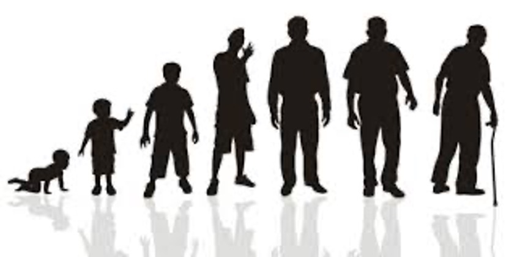
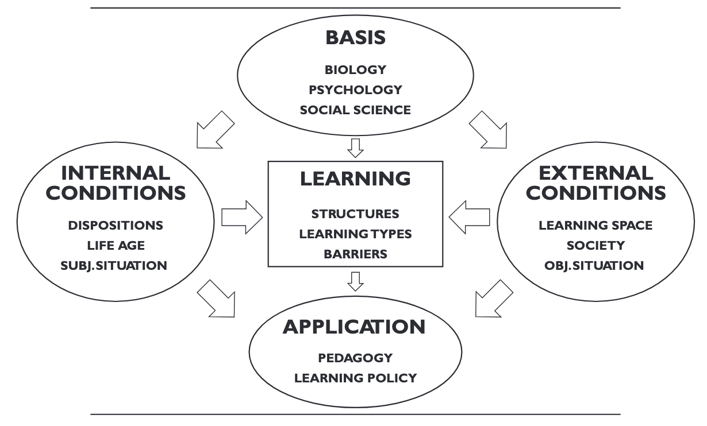
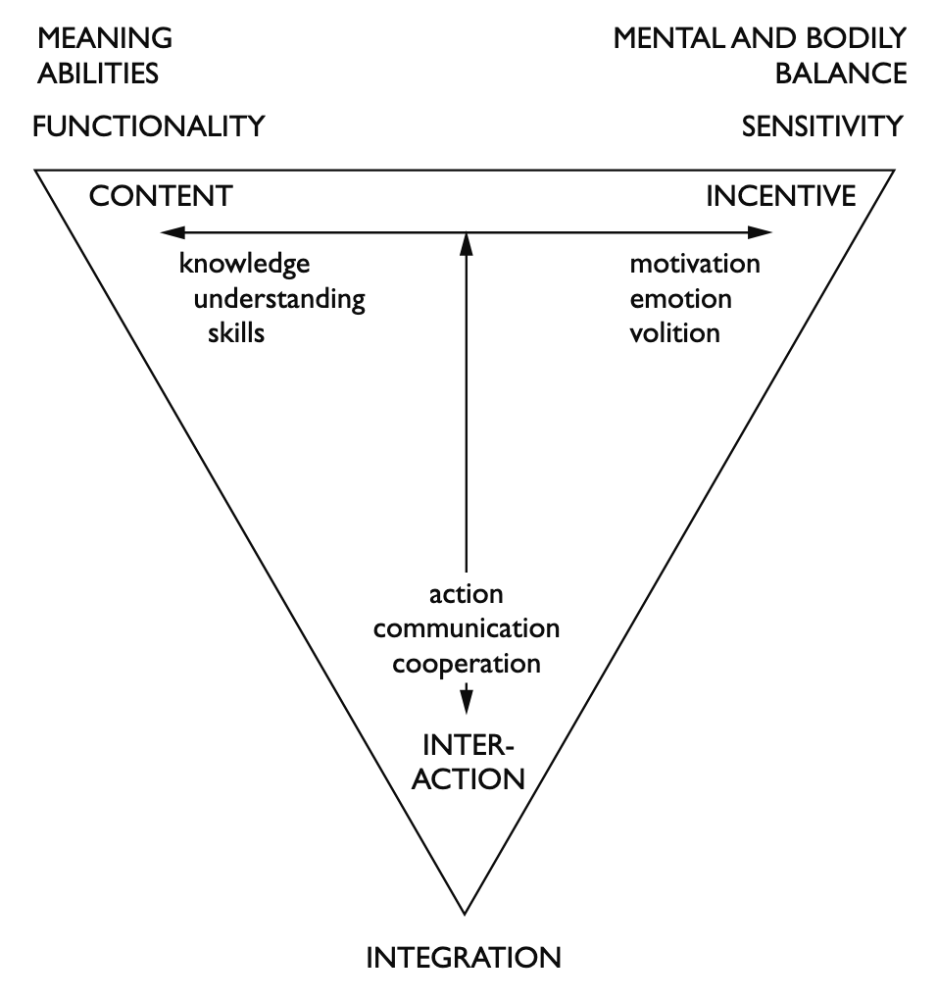
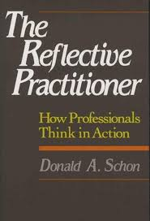
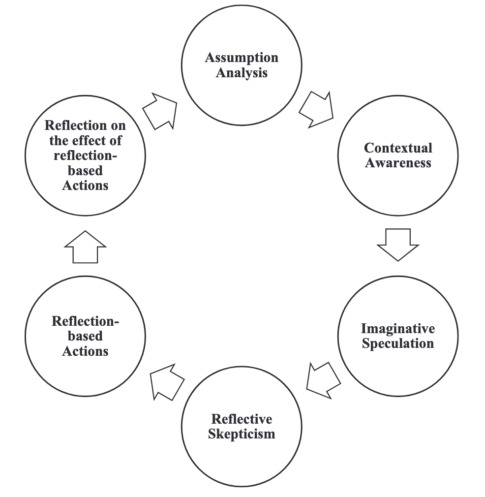
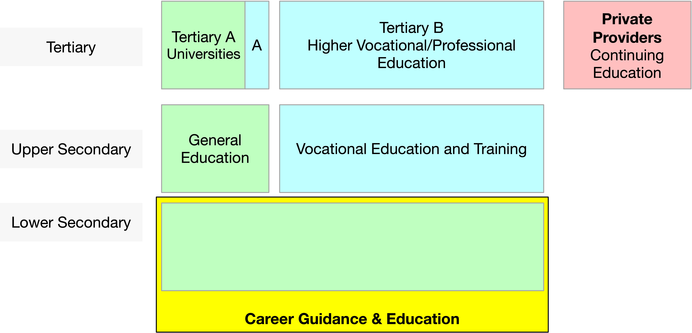
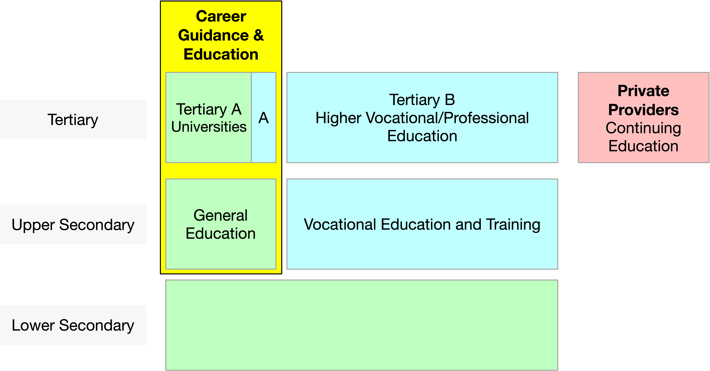

# Transformationen in Transitionen

::: {=html}

C. Nägele, PH FHNW & Uni Basel

:::

*Entwicklungs- und lerntheoretischer Blick auf Transitionen*
  
Dr. Christof Nägele · Uni Basel & PH FHNW

::: {.links}
[ADAM](https://adam.unibas.ch/go/crs/2097884). 
[Programm](https://drive.switch.ch/index.php/s/y5eDSTL2EMkoXg5)
:::

# Termin 1
Einführung

## Lernen und Entwicklung
  
Wie kann man Jugendliche oder junge Erwachsene in Transitionen am besten unterstützen, mit Fokus auf Lernen und Entwicklung?

## Laufbahn Biographie

Sicher ist, dass es zunehmend mehr darauf ankommt, dass jeder Mensch seine eigene Biographie sowohl im persönlichen und sozialen als auch im beruflichen Bereich gestalten und steuern kann.

Allerdings kommt es heute darauf an, diesen Prozess nicht nur von seinem Ergebnis her zu sehen. 
Viel wichtiger ist, ihn selbst als eine persönliche Entwicklungschance zu begreifen und pädagogisch zu nutzen. 

::: {.source }
Eckert, M. (2008). Defizite in der Berufsvorbereitung—Was ist ein gelingender Übergang von der Schule in den Beruf? In E. Schlemmer & H. Gerstberger (Eds), Ausbildungsfähigkeit im Spannungsfeld zwischen Wissenschaft, Politik und Praxis (pp. 149–159). VS Verlag für Sozialwissenschaften.
:::

## Laufbahn Karriere

- *career as life process*  
Career is about an ongoing process that accompanies the person’s entire life. 

- *career as individual agency*   
If career is recognised as a life process, it is vital to identify and understand the human participation in this process. 

- *career as meaning making*  
one’s life career development means a very complex and dynamic person-in-context process. 

## Begriffe

{width=100%}

## Definitionen

- Transitionen
- Transformationen    
- Entwicklung
- Reifung
- Lernen

## Entwicklung

Unter Entwicklung versteht man im Allgemeinen einen Prozess der Entstehung, der Veränderung bzw. des Vergehens, wobei drei Prinzipien zu Grunde liegen: das Prinzip des Wachstums, das Prinzip der Reifung und das Prinzip des Lernens.

::: {.source }
Stangl, W. (2021). Stichwort: Entwicklung. Online Lexikon für Psychologie und Pädagogik. https://lexikon.stangl.eu/12182/entwicklung (2021-03-02)
:::

## Reifung

Als Reifung Vorgänge klassifiziert, die aufgrund endogen vorprogrammierter und innengesteuerter Wachstumsprozesse einsetzen und auch im weiteren Verlauf größtenteils von diesen gesteuert werden. Alle Vorgänge der Reifung sind letztlich durch Vererbung determiniert, wobei exogene Faktoren wenig bis gar keinen Einfluss auf die Reifung ausüben. 

::: {.source }
Stangl, W. (2021). Stichwort: Reifung. Online Lexikon für Psychologie und Pädagogik. https://lexikon.stangl.eu/1842/reifung#comments (2021-03-02)
:::

## Entwicklung: Life-Designing

Individuals in the knowledge societies at the beginning of the 21st century must realize that career problems are only a piece of much broader concerns about how to live a life in a postmodern world shaped by a global economy and supported by information technology.

::: {.source }
Savickas, M. L., Nota, L., Rossier, J., Dauwalder, J.-P., Duarte, M. E., Guichard, J., Soresi, S., Van Esbroeck, R., & van Vianen, A. E. M. (2009). Life designing: A paradigm for career construction in the 21st century. Journal of Vocational Behavior, 75(3), 239–250. https://doi.org/10.1016/j.jvb.2009.04.004
:::

## Entwicklung Laufbahn

Life-designing intervention 

- Adaptability
- Narratability
- Activity
- Intentionality

::: {.source }
Savickas, M. L., Nota, L., Rossier, J., Dauwalder, J.-P., Duarte, M. E., Guichard, J., Soresi, S., Van Esbroeck, R., & van Vianen, A. E. M. (2009). Life designing: A paradigm for career construction in the 21st century. Journal of Vocational Behavior, 75(3), 239–250. https://doi.org/10.1016/j.jvb.2009.04.004
:::

## Lernen

Unter Lernen versteht man den absichtlichen oder den beiläufigen, individuellen oder kollektiven Erwerb von geistigen, körperlichen, sozialen Kenntnissen, Fähigkeiten und Fertigkeiten. 
Lernen bedeutet, die Zukunft vorhersagen zu können und das Verhalten dementsprechend anzupassen. 

::: {.source } 
Stangl, W. (2021). Stichwort: Lernen. Online Lexikon für Psychologie und Pädagogik. https://lexikon.stangl.eu/551/lernen/ (2021-03-02)
:::

## Arten des Lernens

- Kumulation - Dressur
- Assimilation – additives Lernen
- Akkommodation – ausweitendes Lernen, neues Verständnis, neues Verhalten
- Transformatives Lernen

::: {.links }
Illeris, K. (2008). Lernen umfassend verstehen. In 26° Curso Seminario Internacional de Estudios sobre la Formación Profesional y la Enseñanza en el Sector de la Agricultura(August). 
:::

## Struktur Lerntheorie

{width=100%}

::: {.source }
Illeris, K. (2009). A comprehensive understanding of human learning. In K. Illeris (Ed.), Contemporary theories of learning: Learning theorists ... In their own words (pp. 7–20). Routledge.
:::

## Zwei Grundprozesse

1. Externe Interaktion zwischen Lernenden und der sozialen, kulturellen und materiellen Umgebung.  
2. Interner psychologischer Prozess der Erarbeitung und Aneignung, bei dem neue Impulse mit den Ergebnissen von vorher erworbenen Kenntnissen verknüpft werden.

::: {.source}
Illeris, K. (2008). Lernen umfassend verstehen. In 26° Curso Seminario Internacional de Estudios sobre la Formación Profesional y la Enseñanza en el Sector de la Agricultura(August). 
:::

## Lernen Drei Dimensionen

{width=100%}

::: {.source }
Illeris, K. (2009). A comprehensive understanding of human learning. In K. Illeris (Ed.), Contemporary theories of learning: Learning theorists ... In their own words (pp. 7–20). Routledge.
:::

## Lernen Drei Dimensionen

Inhaltliche Dimension von Wissen, Verstehen, Fähigkeiten, Können, Verhaltensweisen, Arbeitsmethoden, Werten etc.   
Emotionale Dimension von Gefühlen, Motivation und Wollen.   
Soziale Dimension von Interaktion, Kommunikation und Kooperation – die alle in einen gesellschaftlichen Kontext eingebettet sind. 

::: {.source }
Illeris, K. (2008). Lernen umfassend verstehen. In 26° Curso Seminario Internacional de Estudios sobre la Formación Profesional y la Enseñanza en el Sector de la Agricultura(August). 
:::

## Wann und wo lernen wir?

- Informell – Formal 
- Implizit - Explizit

## Theorie oder Tun?

Throughout most of history, teaching and learning have been based on apprenticeship. 
Children learned how to speak, grow crops, construct furniture, and make clothes. 
But they didn't go to school to learn these things; instead, adults in their family and in their communities showed them how, and helped them do it…

::: {.source }
Collins, A. (2006). Cognitive apprenticeship. In K. R. Sawyer (Ed.), The Cambridge handbook of the learning sciences. Cambridge University Press.
:::

## Learning in Activity

The defining characteristic of a situative approach is that instead of focusing on individual learners, the main focus of analysis is on activity systems: complex social organizations containing learners, teachers, curriculum materials, software tools, and the physical environment.   
From the situative perspective, all socially organized activities provide opportunities for learning to occur, including learning that is different from what a teacher or designer might wish. 

::: {.source }
Greeno, J. G. (2006). Learning in activity. In K. R. Sawyer (Ed.), The Cambridge handbook of the learning sciences. Cambridge University Press. 
:::

## Reflexion

{width=100%}

## Reflection

- Reflection-on-action (taking place a posteriori, when the task is already accomplished) 
- Reflection-in-action (occurring while performing the task) are equally important to increasing one’s professionalism.

::: {.source }
Cattaneo, A. A. P., & Motta, E. (2021). “I reflect, therefore I am… a good professional”. On the relationship between reflection-on-action, reflection-in-action and professional performance in vocational education. Vocations and Learning, 14(2), 185–204. https://doi.org/10.1007/s12186-020-09259-9
:::

## Transformatives Lernen

Transformative learning is defined as the process by which we transform problematic frames of reference (mindsets, habits of mind, meaning perspectives) – sets of assumption and expectation – to make them more inclusive, discriminating, open, reflective and emotionally able to change.

::: {.source }
Mezirow, J. (2009). An overview on transformative learning. In K. Illeris (Ed.), Contemporary theories of learning: Learning theorists ... In their own words (pp. 90–105). Routledge.
:::

## Reflection on...

- Process
- Content
- Goal
- ...

::: {.source }
Liu, K. (2020). Critical reflection for transformative learning: Understanding e-portfolios in teacher education. Springer International Publishing. https://doi.org/10.1007/978-3-319-01955-0
:::

## Critical Reflection 

{width=100%}

::: {.source }
Liu, K. (2020). Critical reflection for transformative learning: Understanding e-portfolios in teacher education. Springer International Publishing. https://doi.org/10.1007/978-3-319-01955-0
:::

# Termin 2
 
Lektüre

Hoggan, C., Hoggan-Kloubert, T., & Kraus, K. (2026). Life transitions, daily living, and transformative learning: Insights from a migration journey. In M. Bernhard, S. Billett, C. Hof, V. J. Marsick, & P. H. Sawchuk (Eds), *Adult education in changing times* (pp. 187–202). Routledge.

Keane, M., Khupe, C., & Mpofu, V. (2022). Reflections on transformation: Stories from Southern Africa. In A. Nicolaides, S. Eschenbacher, P. T. Buergelt, Y. Gilpin-Jackson, M. Welch, & M. Misawa (Eds), *The Palgrave handbook of learning for transformation* (pp. 521–536). Springer International Publishing. https://doi.org/10.1007/978-3-030-84694-7_29 

## Leitfrage

Wie, und von wem, kann Unterstützung im Übergang von Sek I über Sek II in Erwerbsarbeit oder Tertiärbildung als lern- und entwicklungsorientierter Prozess gestaltet werden, der Reflexion, Transformation und Identitätsentwicklung ermöglicht?

## Life Transitions, Daily Living, and Transformative Learning

**Reflection and introspection**

- *Critical self-reflection* 
  Critical self-reflection refers to the process of questioning one’s taken-for-granted assumptions, beliefs, and perspectives in order to enable transformative learning (Mezirow, 2000).
- *Soul work* 
  “Soul work” refers to the engagement of emotions, imagination, and inner experience in processes of meaning-making and learning (Dirkx, 2001).
- *Narrative reconstruction* 
  Narrative reconstruction refers to the process of reinterpreting and reorganising one’s life experiences into a coherent story that enables new meanings and orientations for future action (Hoggan-Kloubert, 2024).

## Transformative Learning: Ten Steps Mezirow

<table>
<tr>
<td><b>1. Trigger & Disruption</b></td>
<td>
• Disorienting dilemma 
• Self-examination (incl. emotions)  
Something disrupts existing meaning structures.
</td>
</tr>

<tr>
<td><b>2. Critical Reflection</b></td>
<td>
• Critical assessment of assumptions 
• Recognition of shared experiences  
Old perspectives are questioned and relativised.
</td>
</tr>

<tr>
<td><b>3. Exploration & Planning</b></td>
<td>
• Exploration of new roles/actions 
• Planning a course of action 
• Acquiring knowledge and skills  
New possibilities are considered and prepared.
</td>
</tr>

<tr>
<td><b>4. Experimentation</b></td>
<td>
• Trying out new roles  
New ways of being are tested in practice.
</td>
</tr>

<tr>
<td><b>5. Integration</b></td>
<td>
• Building competence and confidence 
• Reintegration with a transformed perspective  
The new perspective becomes part of everyday life.
</td>
</tr>

</table>

::: {.source}
Mezirow, J., & Associates. (2000). *Learning as transformation: Critical perspectives on a theory in progress*. Jossey-Bass Publishers.
:::

## Perspectives 

*Constructivist perspective* 
Transformative learning is seen as a process in which individuals actively construct new meanings by critically reflecting on their experiences, revising prior assumptions, and integrating new understandings into their worldview.

*Psychoanalytic perspective* 
Transformative learning is understood as a process that involves uncovering and working through unconscious emotions, desires, and inner conflicts, allowing deeper shifts in identity and meaning-making beyond purely rational reflection.

*Situative perspective* 
Transformative learning is understood as emerging through participation in social practices and contexts, where meaning is shaped in interaction with the environment.

## Daily Lived Experience

Transformative learning is deeply embedded within specific contexts and unfolds through interactions with the environment and other people.   
This approach is particularly relevant when examining significant life changes

## Reflections on Transformation:  Stories from Southern Africa 

Transformative learning includes emerging from closed worlds to expanded understandings and connections. 
Escaping from fixed and limiting, or biased views, requires not only “Border-crossing”, but a transcending of borders. 
Transformative learning starts with the individual and is shaped by our different environments. 
We move from within our own inner and outer context to a new position of understanding. 
In this, our learning moves us toward liberation from limiting perspectives.

## Storytelling

Humans are storytelling beings who, individually and socially, lead storied lives.

- Stories provide a healing rather than a factual truth.  
- Stories allow for nuanced perspectives and interpretations.  
- Stories contribute to learning.
- Stories combine fact and fiction together with feeling.

## Paths of Transformation

- Transformation begins with awareness, openness, and empathetic intention.
- Through noticing worldviews, we are more able to think beyond them.
- Transformation is only visible to oneself when one pauses to reflect on the past.
- Narratives present a helpful lens.
- Paths unfold as we walk them

# Termin 3
 
Lektüre

Wenger, E. (2009). A social theory of learning. In K. Illeris (Ed.), *Contemporary theories of learning: Learning theorists ... In their own words* (pp. 209–218). Routledge.

Bernhard, M., Billett, S., & Kraus, K. (2026). Learning at the nexus of life course, work, and transitions. In V. J. Marsick & P. H. Sawchuk, *Adult education in changing times* (1st edn, pp. 29–45). Routledge. https://doi.org/10.4324/9781003584384-4

# A Social Theory of Learning

Lernen ist ein sozialer Prozess, in dem Menschen durch Teilnahme (participation) an gemeinsamer Praxis (practice) Bedeutung (meaning) aushandeln und ihre Identität (identity) entwickeln.

## Wichtige Begriffe

<table style="width: 100%; border-collapse: collapse;">
  <tr>
    <td style="width: 46%; vertical-align: top; padding: 4px 12px 4px 0;">Lernen ist soziale Teilnahme  (learning as social participation)</td>
    <td class="fragment" style="width: 54%; vertical-align: top; padding: 4px 0 4px 12px;">Eine Lernende versteht einen Inhalt besser, indem sie mit anderen diskutiert, Fragen stellt und gemeinsam Aufgaben löst.</td>
  </tr>
  <tr>
    <td style="vertical-align: top; padding: 4px 12px 4px 0;">Praxisgemeinschaften  (communities of practice)</td>
    <td class="fragment" style="vertical-align: top; padding: 4px 0 4px 12px;">Eine Gruppe von Lernenden entwickelt gemeinsam Strategien, wie sie Aufgaben lösen oder sich auf Prüfungen vorbereiten.</td>
  </tr>
  <tr>
    <td style="vertical-align: top; padding: 4px 12px 4px 0;">Lernen als Identitätsentwicklung  (identity formation)</td>
    <td class="fragment" style="vertical-align: top; padding: 4px 0 4px 12px;">Eine Person beginnt sich selbst als „jemand, der das versteht“ oder „der das nicht kann“ zu sehen.</td>
  </tr>
  <tr>
    <td style="vertical-align: top; padding: 4px 12px 4px 0;">Bedeutung durch Teilnahme und Vergegenständlichung  (participation & reification)</td>
    <td class="fragment" style="vertical-align: top; padding: 4px 0 4px 12px;">Eine Gruppe entwickelt gemeinsam Materialien, Dokumente oder Modelle, die ihre Erfahrungen strukturieren und verständlich machen.</td>
  </tr>
  <tr>
    <td style="vertical-align: top; padding: 4px 12px 4px 0;">Praxis  (practice)</td>
    <td class="fragment" style="vertical-align: top; padding: 4px 0 4px 12px;">Lernende übernehmen typische Vorgehensweisen, z. B. wie man ein Problem analysiert oder eine Aufgabe strukturiert.</td>
  </tr>
  <tr>
    <td style="vertical-align: top; padding: 4px 12px 4px 0;">Vom Rand zur Teilhabe  (legitimate peripheral participation)</td>
    <td class="fragment" style="vertical-align: top; padding: 4px 0 4px 12px;">Eine Person beteiligt sich zunächst wenig und beobachtend und bringt sich später aktiv in Diskussionen ein.</td>
  </tr>
  <tr>
    <td style="vertical-align: top; padding: 4px 12px 4px 0;">Lernen als Prozess über Zeit  (trajectories)</td>
    <td class="fragment" style="vertical-align: top; padding: 4px 0 4px 12px;">Eine Lernende entwickelt sich von einem ersten Verständnis hin zu sicherem Anwenden eines Konzepts.</td>
  </tr>
  <tr>
    <td style="vertical-align: top; padding: 4px 12px 4px 0;">Lernen an Grenzen zwischen Gemeinschaften  (boundaries / boundary crossing)</td>
    <td class="fragment" style="vertical-align: top; padding: 4px 0 4px 12px;">Eine Person merkt, dass Wissen aus einem Kontext (z. B. Schule) anders angewendet werden muss als in einem anderen Kontext (z. B. Praxis).</td>
  </tr>
</table>

## Wie Communities of Practice aussehen

<table style="width: 100%; border-collapse: collapse;">
  <tr>
    <th style="width: 34%; text-align: left; vertical-align: top; padding: 4px 12px 6px 0;">Activity</th>
    <th style="width: 66%; text-align: left; vertical-align: top; padding: 4px 0 6px 12px;">Example</th>
  </tr>
  <tr>
    <td style="vertical-align: top; padding: 4px 12px 4px 0;">Problem solving</td>
    <td style="vertical-align: top; padding: 4px 0 4px 12px;">"Can we work on this design and brainstorm some ideas; I’m stuck."</td>
  </tr>
  <tr>
    <td style="vertical-align: top; padding: 4px 12px 4px 0;">Requests for information</td>
    <td style="vertical-align: top; padding: 4px 0 4px 12px;">"Where can I find the code to connect to the server?"</td>
  </tr>
  <tr>
    <td style="vertical-align: top; padding: 4px 12px 4px 0;">Seeking experience</td>
    <td style="vertical-align: top; padding: 4px 0 4px 12px;">"Has anyone dealt with a customer in this situation?"</td>
  </tr>
  <tr>
    <td style="vertical-align: top; padding: 4px 12px 4px 0;">Reusing assets</td>
    <td style="vertical-align: top; padding: 4px 0 4px 12px;">"I have a proposal for a local area network I wrote for a client last year. I can send it to you and you can easily tweak it for this new client."</td>
  </tr>
  <tr>
    <td style="vertical-align: top; padding: 4px 12px 4px 0;">Coordination and synergy</td>
    <td style="vertical-align: top; padding: 4px 0 4px 12px;">"Can we combine our purchases of solvent to achieve bulk discounts?"</td>
  </tr>
  <tr>
    <td style="vertical-align: top; padding: 4px 12px 4px 0;">Discussing developments</td>
    <td style="vertical-align: top; padding: 4px 0 4px 12px;">"What do you think of the new CAD system? Does it really help?"</td>
  </tr>
  <tr>
    <td style="vertical-align: top; padding: 4px 12px 4px 0;">Documentation projects</td>
    <td style="vertical-align: top; padding: 4px 0 4px 12px;">"We have faced this problem five times now. Let us write it down once and for all."</td>
  </tr>
  <tr>
    <td style="vertical-align: top; padding: 4px 12px 4px 0;">Visits</td>
    <td style="vertical-align: top; padding: 4px 0 4px 12px;">"Can we come and see your after-school program? We need to establish one in our city."</td>
  </tr>
  <tr>
    <td style="vertical-align: top; padding: 4px 12px 4px 0;">Mapping knowledge and identifying gaps</td>
    <td style="vertical-align: top; padding: 4px 0 4px 12px;">"Who knows what, and what are we missing? What other groups should we connect with?"</td>
  </tr>
</table>

::: {.source}
Wenger, E. (2011). Communities of practice: A brief introduction.
:::

## Relevanz der Theorie im Übergang 
 

Übergänge können als Prozesse verstanden werden, in denen sich Individuen zwischen Praxisgemeinschaften bewegen und dabei ihre Teilnahme, Bedeutungszuschreibungen und Identität neu aushandeln.

## Konkret

<table style="width: 100%; border-collapse: collapse;">
  <tr>
    <th style="width:33%; text-align: left; vertical-align: top; padding: 4px 12px 6px 0;">Konzept</th>
    <th style="width:33%; text-align: left; vertical-align: top; padding: 4px 0 6px 12px;">Beispiel</th>
    <th style="width:33%; text-align: left; vertical-align: top; padding: 4px 0 6px 12px;">Konsequenz</th>
  </tr>
  <tr>
    <td style="width:33%; vertical-align: top; padding: 4px 12px 4px 0;">Übergänge = Wechsel zwischen Praxisgemeinschaften</td>
    <td style="width: 33%; vertical-align: top; padding: 4px 0 4px 12px;">	•	Schule → Betrieb   •	Sek I → Sek II</td>
    <td style="width: 33%; vertical-align: top; padding: 4px 0 4px 12px;">Eintritt in neue Gemeinschaften mit anderen Praktiken</td>
  </tr>
  <tr>
    <td style="width:33%; vertical-align: top; padding: 4px 12px 4px 0;">Lernen als Bewegung (Trajektorien)</td>
    <td style="width: 33%; vertical-align: top; padding: 4px 0 4px 12px;">	Übergänge sind keine punktuellen Ereignisse: Entwicklungsprozesse über Zeit</td>
    <td style="width: 33%; vertical-align: top; padding: 4px 0 4px 12px;">Es braucht genügend Zeit</td>
  </tr>
  <tr>
    <td style="width:33%; vertical-align: top; padding: 4px 12px 4px 0;">Identität im Zentrum</td>
    <td style="width: 33%; vertical-align: top; padding: 4px 0 4px 12px;">	von „Schüler:in“ → „Lernende:r / Fachperson</td>
    <td style="width: 33%; vertical-align: top; padding: 4px 0 4px 12px;">Es geht nicht nur um Fachwissen, Informationen</td>
  </tr>
  <tr>
    <td style="width:33%; vertical-align: top; padding: 4px 12px 4px 0;">Grenzen zwischen Gemeinschaften (Boundaries)</td>
    <td style="width: 33%; vertical-align: top; padding: 4px 0 4px 12px;">	Übergänge = Grenzübertritte 
	•	unterschiedliche Erwartungen 
	•	unterschiedliche Praktiken 
	•	unterschiedliche Kulturen </td>
    <td style="width: 33%; vertical-align: top; padding: 4px 0 4px 12px;">Missverständnisse  Anpassungsprobleme</td>
  </tr>
  <tr>
    <td style="width:33%; vertical-align: top; padding: 4px 12px 4px 0;">Vermittlung zwischen Kontexten</td>
    <td style="width: 33%; vertical-align: top; padding: 4px 0 4px 12px;">erfolgreiche Übergänge brauchen:  Brücken (boundary crossing)  Personen, die vermitteln (broker) </td>
    <td style="width: 33%; vertical-align: top; padding: 4px 0 4px 12px;">	Lehrer:innen, Berufsbildner:innen</td>
  </tr>
  <tr>
    <td style="width:33%; vertical-align: top; padding: 4px 12px 4px 0;">Teilnahme neu verhandeln</td>
    <td style="width: 33%; vertical-align: top; padding: 4px 0 4px 12px;">Lernende müssen:
	•	ihre Rolle neu finden
	•	ihren Platz in der neuen Gemeinschaft klären</td>
    <td style="width: 33%; vertical-align: top; padding: 4px 0 4px 12px;">	von peripherer Teilnahme
→ zu aktiver Beteiligung
</td>
  </tr>
</table>

## Aktivitäten einer Community of Practice "Übergang"

Domain 
Identity defined by a shared domain of interest.

Community 
Members of a community engage in joint activities and discussions, help each other, and share information

Practice 
They develop a shared repertoire of resources: experiences, stories, tools, ways of addressing recurring problems. 

::: {.source}
Wenger, E. (2011). Communities of practice: A brief introduction.
:::

## Wie könnte das umgesetzt werden? 
 
A social theory of learning  
Wie kann man Jugendliche/junge Erwachsene im Übergang Sek I -> Sek II -> Arbeit/Tertiär am besten unterstützen, wenn der Fokus auf Lernen und Entwicklung liegen soll? 

## Unterstützung

::: {.small-text}

Übergänge sind mehr als Entscheidungen 
Sinn- und Bedeutungsfragen einbeziehen 

Zugang zu Praxis 
Schnupperlehre, Praktika, erfahrungsbasierte Formate, aktive Auseinandersetzung 

Zugehörigkeit 
soziale Integration im Betrieb / Schule, Unterstützung beim „Dazugehören“ 

Übergänge sind Identitätsprozesse 
Identitätsentwicklung unterstützen, nicht nur Informationen liefern 

Unterschiedliche Lernlogiken treffen aufeinander 
Brüche und Anpassungsprozesse

Übergänge als Aushandlungsprozesse 
Begleitung, Reflexionsräumen

:::

# Learning at the Nexus of Life Course, Work, and Transitions

# Aussagen

::: {.small-text}
- Learning is something people do for themselves; it cannot simply be done for them.
- Learning changes what people **know**, **can do**, **perceive**, and **value**.
- Meaning-making is a process of **remaking**, shaped by biography and previous experience rather than simple copying.
- At the nexus of life course, work, and transitions, learning is marked by:
  - positionality and subjectivity
  - translation and transitions
  - relating knowledge and lived experience

:::

## Einbettung
 
*Processes*: learning taking place in biographies, everyday life, and liminal spaces 

*Contexts*: relationships with institutions, organisations, and society 

*Qualities*: positionality, translation, and relating knowledge and experience 

## Kerngedanken
 

Learning emerges at the intersection (“nexus”) of three domains:  
	•	the life course (biography, personal development) 
	•	work (labour market, practice, occupations) 
	•	transitions (changes between roles, contexts, statuses)  

Learning cannot be understood without considering all three together.

## Key Arguments

<table style="width: 100%; border-collapse: collapse;">
  <tr>
    <th style="width: 28%; text-align: left; vertical-align: top; padding: 4px 8px 6px 0;">Argument</th>
    <th style="width: 48%; text-align: left; vertical-align: top; padding: 4px 8px 6px 0;">Detail</th>
    <th style="width: 24%; text-align: left; vertical-align: top; padding: 4px 0 6px 0;">Takeaway</th>
  </tr>
  <tr>
    <td style="vertical-align: top; padding: 4px 8px 6px 0;">Learning is relational and situated</td>
    <td style="vertical-align: top; padding: 4px 8px 6px 0;">Learning is shaped by the interaction between individual agency and social structures (institutions, norms, work contexts).</td>
    <td style="vertical-align: top; padding: 4px 0 6px 0;">It is not purely individual, but co-constructed in context.</td>
  </tr>
  <tr>
    <td style="vertical-align: top; padding: 4px 8px 6px 0;">Transitions are key moments for learning</td>
    <td style="vertical-align: top; padding: 4px 8px 6px 0;">Life transitions (e.g. entering work, changing jobs, migration) create uncertainty, disruption, and a need for adaptation.</td>
    <td style="vertical-align: top; padding: 4px 0 6px 0;">These moments trigger learning processes.</td>
  </tr>
  <tr>
    <td style="vertical-align: top; padding: 4px 8px 6px 0;">Learning is embedded in the life course</td>
    <td style="vertical-align: top; padding: 4px 8px 6px 0;">Learning is linked to biography, past experiences, and future expectations.</td>
    <td style="vertical-align: top; padding: 4px 0 6px 0;">Individuals interpret transitions through their life histories.</td>
  </tr>
  <tr>
    <td style="vertical-align: top; padding: 4px 8px 6px 0;">Work is a central site of learning</td>
    <td style="vertical-align: top; padding: 4px 8px 6px 0;">Work is not just application of knowledge; it is a primary context for learning and development.</td>
    <td style="vertical-align: top; padding: 4px 0 6px 0;">Learning occurs through participation, practice, and engagement in work activities.</td>
  </tr>
  <tr>
    <td style="vertical-align: top; padding: 4px 8px 6px 0;">Transitions are negotiated, not given</td>
    <td style="vertical-align: top; padding: 4px 8px 6px 0;">Individuals actively interpret and deal with transitions; outcomes depend on personal resources and social conditions.</td>
    <td style="vertical-align: top; padding: 4px 0 6px 0;">Learning = coping with and shaping change.</td>
  </tr>
  <tr>
    <td style="vertical-align: top; padding: 4px 8px 0 0;">Multiple levels interact</td>
    <td style="vertical-align: top; padding: 4px 8px 0 0;">Interaction between societal change, institutional structures, and individual experiences.</td>
    <td style="vertical-align: top; padding: 4px 0 0 0;">Learning happens in this multi-level interplay.</td>
  </tr>

</table>

## Wie könnte das umgesetzt werden? 
 
Learning at the Nexus of Life Course, Work, and Transitions  
Wie kann man Jugendliche/junge Erwachsene im Übergang Sek I -> Sek II -> Arbeit/Tertiär am besten unterstützen, wenn der Fokus auf Lernen und Entwicklung liegen soll? 

# Unterstützung
 

::: {.small-text}

Lebenslauf → Biografie zählt 
Erfahrungen, Erwartungen, Selbstkonzepte  

Arbeit → Lernen durch Teilnahme 
konkrete Tätigkeiten, Teilnahme an Praxis  

Übergang → Auslöser für Lernen 
Unsicherheit, neue Anforderungen  

Übergänge müssen ausgehandelt werden 
Rolle klären, Erwartungen interpretieren  

Zusammenspiel von Struktur und Individuum 
Möglichkeiten (Lehrstelle, Unterstützung, individuellem Engagement

:::

# Termin 4

Illeris, K. (2014). Transformative learning and identity. *Journal of Transformative Education*, 12(2), 148–163. https://doi.org/10.1177/1541344614548423

Urpi, C., & Gamarra, M. (2022). Preventing adolescence through educational counselling on personal and vocational identity. *Journal of Health Care Education in Practice, 4*(11/2022), 31–40. https://doi.org/10.14658/pupj-jhcep-2022-2-4

## Transformative Learning and Identity (Illeris, 2014)

Kegan’s (2000) very direct question has never been answered clearly and satisfactorily!

The question was:  
What exactly is it that changes in transformative learning?

### The New Generation

“For the new generations growing up since the 1980s, the task or duty of creating, maintaining, and changing their own identities has become increasingly important and fundamental. Who am I? Who do I want to be? How can I fulfill my dreams? The possibilities may be great and never ending for some. But for others, the many choices can become a strain, a continuous demonstration of their insufficient individual capacity to make things function.” ([Illeris, 2014, p. 155]

::: {.source}
(zotero://select/library/items/W6ZEFPGE)) ([pdf](zotero://open-pdf/library/items/6PMD9GPI?page=8&annotation=ZJECWVHK))
:::

### Transformative Learning (Illeris, 2014)

- Transformative learning = **changes in identity**
- Goes beyond cognition, includes dimensions:
  - emotional
  - social
  - contextual

> Shift: from *thinking differently* → to *being different*

### Problem of Mezirow's Theory 

- Focus on:
  - meaning perspectives
  - frames of reference
- Strongly cognitive orientation
- Neglects:
  - emotions
  - social context

### Illeris’ Key Idea

- Transformative learning = **identity transformation**
- Identity connects:
  - individual (inner self)
  - society (social world)

> More comprehensive than purely cognitive models

## Structure of Identity

- *Core identity*
  - stable self
  - “Who I am”

- *Personality layer*
  - values, attitudes, perspectives
  - main area of transformation

- *Preference layer*
  - habits, routines, everyday behaviour

## When Does Transformation Occur?

- Changing important identity elements requires 
  - strong motivation
  - personal relevance

## Barriers To Transformation

- *Identity defence*
  - protects stability
  - resists deep change

- Not all learning becomes transformative

## Types Of Transformation

- *Progressive*
  - development, growth

- *Regressive*
  - withdrawal, overload

- *Restoring*
  - adjusting to realistic goals

## Development Across the Lifespan

- Childhood 
  no real transformative learning

- Youth 
  identity formation begins

- Adulthood 
  main phase of transformative learning

## Key Takeaway

> Transformative learning is not just changing what we think,  
> but transforming who we are in relation to ourselves and society.

## Wie könnte das umgesetzt werden? 

Transformative learning and identity  
Wie kann man Jugendliche/junge Erwachsene im Übergang Sek I -> Sek II -> Arbeit/Tertiär am besten unterstützen, wenn der Fokus auf Lernen und Entwicklung liegen soll? 

## Personal and Vocational Identity  X(Urpi & Gamarra, 2022)

Key question: 
How educational and vocational counselling can support adolescents in developing personal and vocational identity under conditions of stress and uncertainty.

### Problem Statement

::: {.small-text}

**Central questions**  
Who am I? Who do I want to become? With whom do I want to spend my life? Which values and principles guide me?

::: {.cols}

::: {}
**Key influences**

- family
- counselling

**Lacking resources**

- adolescents often lack resources for decision-making
- especially regarding career and life choices

:::

::: {}

**Consequence**

- they need early, structured guidance
- through educational and vocational counselling
:::

:::

:::

### Family 

OK, but: 
“In short, starting with the necessary support from the family, school and society, young people need professional means to provide vocational guidance in order to undertake on their own the personal and professional project they really want to develop.”

::: {.source}
[Urpi and Gamarra, 2022, p. 36](zotero://select/library/items/WVTXZ5IR) · [pdf](zotero://open-pdf/library/items/9E3MPGMX?page=6&annotation=X8TKMMLA)
:::

### Guidance

“Vocational guidance helps the young person to identify the main difficulties they may encounter at the end of the school stage and to face the process of choosing higher academic or professional studies; it helps them to reflect on what measures can facilitate this process, after becoming aware of what they like, what they dream of and where they would like to see themselves in a few years' time.”

::: {.source}
[Urpi and Gamarra, 2022, p. 36](zotero://select/library/items/WVTXZ5IR) · [pdf](zotero://open-pdf/library/items/9E3MPGMX?page=6&annotation=ZCQM4EZM)
:::

## Some Important Points of the Paper

### Adolescence As A Critical Phase

- Adolescence is a period of crisis, change, and decision-making
- Personal and vocational identity are shaped during this stage
- Many adolescents experience stress, insecurity, and uncertainty
- Support from adults is therefore especially important

### Challenges For Gen Z

- Adolescents grow up in a volatile, uncertain, complex, and ambiguous world
- Digital life strongly shapes relationships, identity, and decision-making
- Risks include impulsivity, distraction, peer pressure, and superficial self-presentation
- A key challenge is balancing digital life and real life

### Identity Formation

- Adolescents face fundamental questions:
  - Who am I?
  - What do I want to become?
  - What kind of life do I want to lead?
- These questions are closely linked to educational and career decisions
- Lack of self-knowledge makes these decisions more difficult

### Vocational Identity

- Vocational identity is more than choosing a career
- It connects:
  - interests
  - talents
  - values
  - aspirations
  - life project
- A good vocational choice is part of a meaningful personal life project

### Role of the Family

- Parents are important sources of support, trust, and orientation
- Helpful parental influence includes:
  - listening
  - encouragement
  - reflection
  - providing information
- Unhelpful influence includes:
  - pressure
  - imposed expectations
  - projecting their own frustrations onto children

### Role of the School and Counselling

- Teachers and counsellors help adolescents understand themselves better
- Counselling should promote:
  - self-knowledge
  - reflection
  - responsible decision-making
- Guidance should accompany young people, not decide for them

### Educational Counselling

- Educational and vocational counselling helps adolescents:
  - identify strengths and talents
  - reflect on interests and values
  - explore future pathways
  - cope with uncertainty
- Counselling is not only academic
- It also supports broader personal development

### Prevention Perspective

- Guidance should begin before late adolescence
- Early support can reduce:
  - stress
  - poor choices
  - dropout
  - lack of direction
- Prevention means helping young people prepare for future decisions

### Key Message

- Adolescents need guided autonomy
- Effective counselling combines:
  - family support
  - educational guidance
  - personal reflection
- The aim is not only career choice, but the development of a coherent life project

## Wie könnte das umgesetzt werden? 
 
Personal and Vocational Identity  
Wie kann man Jugendliche/junge Erwachsene im Übergang Sek I -> Sek II -> Arbeit/Tertiär am besten unterstützen, wenn der Fokus auf Lernen und Entwicklung liegen soll? 

# Termin 5

Krumboltz, J. D. (2009). The happenstance learning theory. *Journal of Career Assessment, 17*(2), 135–154. (Mitchell et al., 1999) (Krumboltz, 2009)

Mitchell, K. E., Levin, A. S., & Krumboltz, J. D. (1999). Planned happenstance: Constructing unexpected career opportunities. *Journal of Counseling & Development, 77*(2), 115–124. https://doi.org/10.1002/j.1556-6676.1999.tb02431.x

Kokkos, A. (2022). Could transformative learning involve youth? In A. Nicolaides, S. Eschenbacher, P. T. Buergelt, Y. Gilpin-Jackson, M. Welch, & M. Misawa (Eds.), *The Palgrave handbook of learning for transformation* (pp. 883–896). Springer International Publishing. https://doi.org/10.1007/978-3-030-84694-7_49 0/0/00 0:00:00 AM

## Krumboltz: The Happenstance Learning Theory (2009)

What-you-should-be-when-you-grow-up need not and should not be planned in advance.

Four propositions:

1. The goal of career counseling is to help clients learn to take actions to achieve more satisfying career and personal lives-not to make a single career decision.
2. Assessments are used to stimulate learning, not to match personal characteristics with occupational characteristics.
3. Clients learn to engage in exploratory actions as a way of generating beneficial unplanned events.
4. The success of counseling is assessed by what the client accomplishes in the real world outside the counseling session.

# A Strong Sentence

We have no way of knowing in advance the destiny of any individual.

The Happenstance Learning Theory explains that the career destiny of each individual cannot be predicted in advance but is a function of countless planned and unplanned learning experiences beginning at birth.

# Happenstance Learning Theory

In a nutshell, the HLT posits that human behavior is the product of countless numbers of learning experiences made available by both planned and unplanned situations in which individuals find themselves. The learning outcomes include …

- skills
- interests 
- knowledge
- beliefs
- preferences
- sensitivities
- emotions
- future actions
- …

## Why People Behave the Way They Do

- Genetic Influences
- Learning Experiences
  - Instrumental Learning - observe own actions, feedback on own actions
  - Associative Learning - observe environment, reactions of others
- Environmental Conditions and Events
- Parents and Caretakers
- Peer Groups
- Structured Educational Settings
- The Imperfect World

## Propositions

Proposition 1: The goal of career counseling is to help clients learn to take actions to achieve  more satisfying career and personal lives—not to make a single career decision.

Proposition 2: Career assessments are used to stimulate learning, not to match personal characteristics with occupational characteristics.

Proposition 3: Clients learn to engage in exploratory actions as a way of generating beneficial  unplanned events.

Proposition 4: The success of counseling is assessed by what the client accomplishes in the  real world outside the counseling session.

## For Career Counselors

1. Orient client expectations
2. Identify the client’s concern as a starting place
3. Use client’s successful past experiences with unplanned events as a basis for current  actions.
4. Sensitize clients to recognize potential opportunities
5. Overcome Blocks to Action

## For Other Educators

The real goals of education. The problem is that we are not assessing the real goals of education? The real educational goals are evidenced by what students do after they leave school, not by what they do in school.

The complicated role of poverty. School achievement is clearly correlated with family financial resources. Berliner (2006) has compiled a persuasive summary of the evidence showing that poverty is associated with low student achievement.

Walking the talk. Most educational assessments place more value on the ability to use words than on the ability to perform skills.

Learning to love learning. We can teach in a way that makes children either love learning or hate learning.

### Practical Implications

::: {.small-text}

1. Help each child improve from their own starting point. Do not set one success bar for everyone: it will be too easy for some, too hard for others, and right for very few.
2. Focus on individual, not group, achievement. The so-called achievement gap uses large-group averages beyond the reach of any single teacher or school district.
3. Reward improvement across varied learning outcomes. High-stakes multiple-choice tests sample only parts of mathematics and English comprehension, while success also includes areas such as computer skills, singing, dancing, painting, archeology, psychology, chemistry, football, golf, history, biology, foreign languages, and food preparation.
4. Make education satisfying and enjoyable for all participants-students, teachers, parents, counselors, and administrators. Suffering is neither necessary nor desirable for learning.
5. Create conditions that require valuable learning tasks. Students learn best from their own actions, not from lectures.
6. Assess education by students' and graduates' real-world performance. Filling bubbles on a multiple-choice answer sheet is not the goal of education.

:::

## Wie könnte das umgesetzt werden? 
 
Personal and Vocational Identity  
Wie kann man Jugendliche/junge Erwachsene im Übergang Sek I -> Sek II -> Arbeit/Tertiär am besten unterstützen, wenn der Fokus auf Lernen und Entwicklung liegen soll? 

## Planned Happenstance:   Constructing Unexpected Career Opportunities (Levin, Levion, Krumboltz, 1999)

Chance plays an important role in everyones career. No one can predict the future with any accuracy.

::: {.very-small-text}

ABER …
Hauptgründe, weshalb der Zufall in Bildungskontexten nicht gemocht wird: 

1. Nicht vorhersagbar
    * Zufall ist per Definition unberechenbar.
    * Er lässt sich nicht systematisch in Modelle oder Interventionen integrieren.
2. Schwer modellierbar
    * Unterstützung braucht Struktur, Logik und Planbarkeit.
    * Zufall ist „untidy“ (unordentlich, unsystematisch) und widerspricht diesem Anspruch.
3. Gefahr für professionelle Steuerung
    * Beratung zielt darauf, Handlungsfähigkeit und Planung zu fördern.
    * Zu viel Fokus auf Zufall könnte den Eindruck erzeugen, dass Karrieren nicht gestaltbar sind.
4. Didaktisch schwierig
    * Es ist kaum möglich, konkrete Strategien zu vermitteln, wie man mit völlig unvorhersehbaren Ereignissen umgeht, ausser sehr allgemein.

:::

## Strukturen

Providers

**Teachers & Schools** Parents World of work Cantonal career counselling services

Duties

Teacher: Career Orientation at school Career Counsellor: Information

Focus

Finding a follow-up solution in upper secondary education for all students

Who typically takes the initiative?

**Schools**

## Strukturen 

Providers

University career service centres Cantonal career counselling services Private career counsellors and coaches

Duties

Individual counselling Networking activities Job fairs

Focus

Career planning, networking, and transition into the labour market

Who typically takes the initiative?

**Students**

## Aber …

* Die Arbeitswelt ist dynamisch und verändert sich laufend
* Berufe verschwinden und neue entstehen 
* Zukünftige Entwicklungen sind nur begrenzt vorhersehbar
* Karrieren verlaufen selten linear und planbar
* Klassische Matching-Modelle sind zu statisch

## Ich weiss nicht, was ich werden will ...

Untenschiedenheit

=> open-mindedness

When friends ask the client, "So what are you going to do?" 
the client would then respond, "I am learning to keep an open mind about future possibilities".

Expected answer: "I am going to study engineering" …

## Generating, Recognizing, and Encouraging Beneficial Chance Events

Planned happenstance theory includes two concepts: 

(a) Exploration generates chance opportunities for increasing quality of life, and 
(b) skills enable people to seize opportunities.

## Five Skills 

1. Curiosity: exploring new learning opportunities 
2. Persistence: exerting effort despite setbacks 
3. Flexibility: changing attitudes and circumstances 
4. Optimism: viewing new opportunities as possible and  attainable 
5. RiskTaking: taking action in the face of uncertain outcomes

## Facilitate Planned Happenstance 

- Using assessment instruments to generate chance events.
- Eliciting encouragement
- …

## Learning as the Purpose of Career Counseling

Step 1: Normalize planned happenstance in the client's history.
Step 2: Assist clients to transform curiosity into opportunities for learning and exploration.
Step 3: Teach clients to produce desirable chance events.
Step 4: Teach clients to overcome blocks to action.

## Luck Is No Accident: Making the Most of Happenstance in Your Life and Career

Krumboltz, J. D., & Levin, A. S. (2010). *Luck is no accident: Making the most of happenstance in your life and career*. Impact Publishers.

### Structure of the Book

1. Make the Most of Unplanned Events
2. Always Keep Your Options Open
3. Wake Up - Before Your Dream Comes True!
4. Try It - Even Without Knowing the Outcome
5. Go Ahead and Make Mistakes
6. Take Action to Create Your Own Luck
7. Go for the Job - Then Learn the Skills
8. Enjoy Yourself - The Good Life Is a Balanced Life
9. Overcome Self-Sabotage
10. Remember That Luck Is No Accident - Important Lessons About Creating Luck

### Questions

1. List three occupations to which you aspired at some time during  your childhood.
2. Have you ever actually been employed in any of these occupations?
  If “yes” to #2, how similar was the reality of the job to your  childhood image of it?
4. What unexpected event contributed most to your getting your  present (or most recent) employment?
5. What actions had you taken prior to that event that enabled you to be in a position to experience it?
6. What actions had you taken after the event that enabled you to  take advantage of the opportunities it presented?
7. How satisfied are you with your present life?
8. How might you adapt some of the actions that you took in  questions 5 and 6 to begin moving you toward an even more satisfying life now?

# Could transformative learning involve youth?

Kokkos, A. (2022). Could transformative learning involve youth? In A. Nicolaides, S. Eschenbacher, P. T. Buergelt, Y. Gilpin-Jackson, M. Welch, & M. Misawa (Eds), *The Palgrave handbook of learning for transformation* (pp. 883–896). Springer International Publishing. https://doi.org/10.1007/978-3-030-84694-7_49

## A Crucial Question

Is it possible for young people to engage in a critical reconsideration of their points of view which, according to Mezirow (1996, 1997), is also a form of transformative learning?

## Two Ways of Arguing

**Not possible**

The will of others, his own (the young person’s) caprice and circumstances about him tend to produce an isolated momentary act [...] The choice is peculiarly exposed to arbitrary factors, to mere school traditions, to waves of pedagogical fad and fancy, to fluctuating social cross currents. (Dewey, 1933/ 1980, p. 50)

Erikson (1968) posited that adolescents experience a conflict between “identity” and “identity confusion.”

Therefore, the transition to adulthood is long and characterized by identity exploration, instability, in-between feelings, and self-focus (Arnett, 2007).

**Possible**

On this basis, Illeris claims that during youth, and especially during late adolescence where identity is intensively formulated—while at the same time one’s cognitive capacity for dialectical and critical reflection develops—transformative learning is both necessary and possible to occur. (p. 888)

## Youth Can Change Perspectives

The dominant perception within the theoretical field of learning for change is that the critical assessment and transformation of dysfunctional assumptions is a goal of adult education. However, the theoretical views that have been explored in this paper, combined with insights from educational practice, can sustain the argument that young people, as they grow older, are potentially able to engage in critical assessment of points of view that need to be questioned.

=> In this sense, school can be considered as a field where it would be possible for students to engage not only in thoughtful learning but also in challenging their own problematic views or those that are communicated to them.

# Termin 6

Bereit für die Laufbahnplanung

Savickas, M. L., Nota, L., Rossier, J., Dauwalder, J.-P., Duarte, M. E., Guichard, J., Soresi, S., Van Esbroeck, R., & van Vianen, A. E. M. (2009). Life designing: A paradigm for career construction in the 21st century. *Journal of Vocational Behavior, 75*(3), Article 3. https://doi.org/10.1016/j.jvb.2009.04.004 (Savickas et al., 2009)

Covacevich, C., Mann, A., Santos, C., & Champaud, J. (2021). *Indicators of teenage career readiness: An analysis of longitudinal data from eight countries* (OECD Education Working Papers Volume: 258 No. 258). https://doi.org/10.1787/cec854f8-en (Covacevich et al., 2021)

## Life designing: A paradigm for career construction in the 21st century

Savickas, M. L., Nota, L., Rossier, J., Dauwalder, J.-P., Duarte, M. E., Guichard, J., Soresi, S., Van Esbroeck, R., & van Vianen, A. E. M. (2009). Life designing: A paradigm for career construction in the 21st century. *Journal of Vocational Behavior, 75*(3), Article 3. https://doi.org/10.1016/j.jvb.2009.04.004 (Savickas et al., 2009)

### Life-Design

Such conceptualizations of careers and vocational decision making require regular reflection on the self and the environment, receptivity to feedback, and the imagination of possible selves. People’s careers are constructed as individuals make choices that express their self-concepts. The self-concept also is constructed through the specific experiences that people have had in environments they have experienced. Narrative approaches to career counseling rely on these experiences as a meaningful resource for further life designing and building. People’s self-concepts may be altered by new experiences and even by observing the behaviors of others. Their interests are never completely fixed and the self is continuously reconstituted.

### Presuppostions

- From traits and states to context
- From prescription to process
- From linear causality to non-linear dynamics
- From scientific facts to narrative realities
- From describing to modeling

### Goals of Life-Designing Interventions

- Adaptability concern, control, curiosity, confidence, commitment
- Narratability
- Activity
- Intentionality

### Intervention

1. identify the problem and its broader context
2. explore the person's current identity configuration
3. open up new perspectives
4. reframe the problem within a new narrative
5. specify activities that let the person try out and enact that identity

### Wie könnte das umgesetzt werden? 

Life-Design  
Wie kann man Jugendliche/junge Erwachsene im Übergang Sek I -> Sek II -> Arbeit/Tertiär am besten unterstützen, wenn der Fokus auf Lernen und Entwicklung liegen soll? 

## Indicators of teenage career readiness

Covacevich, C., Mann, A., Santos, C., & Champaud, J. (2021). *Indicators of teenage career readiness: An analysis of longitudinal data from eight countries* (OECD Education Working Papers Volume: 258 No. 258). https://doi.org/10.1787/cec854f8-en (Covacevich et al., 2021)

### Career-related Outcomes

- Not in education, employment or training (NEET) status
- Earnings if in full-time employment
- Career satisfaction

### Countries in the Study

- Australia
- Canada
- China
- Germany
- Korea
- the United Kingdom (two datasets)
- the United States (two datasets)
- Uruguay

### Data 

| Country | Age at first data collection | Age at last data collection |
|---------|------------------------------|---------------------------|
| Australia | 15–16 | 25–26 |
| Canada | 15 | 25, 29–30 |
| China | 10–15 / 14–18 | 18–23 / 18–22 |
| Germany | 14–16 | 23–25 |
| Korea | 14–15 | 25–26 |
| United Kingdom | 14–16 | 25–34 |
| United States | 12–16 / 15 | 25–29 / 25 |
| Uruguay | 15–16 | 24–25 |

### Indicators of Teenage Career Readiness

- Exploring the future

Student career exploration can increase the chances of success in the adult labour market. There is evidence that teenagers who engage in conversations about their working futures or who take part in programmes of career exploration or career guidance are more commonly found to enjoy employment boosts as young adults.

- Experiencing the future

First-hand experiences of the workplace such as part-time work, work placements and volunteering can help young people imagine their possible futures in work, confirm or contest their plans and provide them with an opportunity to develop their capacity to aspire.

- Thinking about the future

Teenagers who are uncertain, confused, less ambitious, and who do not see the value of school to their future can be expected to do worse as young adults in the labour market than comparable peers

### Exploring the future 

- School-based career reflection activities: participating in activities that promote reflection, such as participating in career classes or answering career questionnaires 
- Career conversations: speaking to someone individually about a career of interest 
- Engaging with people in work through career talks or job fairs: attending career talks given by people in the world of work or attending job fairs 
- Workplace visits or job shadowing: participation in workplace visits or job shadowing 
- Application and interview skills development activities: participation in school-based activities that teach skills for applying to jobs (such as writing cover letters) and being interviewed for jobs 
- Occupationally-focused short programmes: participation in short occupationally-specific courses within general programmes of education

### Experiencing the future

- Part-time work: participation in part-time or holiday work
- Work placements: participation in short school-mediated work placements
- Volunteering: participation in community-based volunteering

### Thinking about the future

- Career certainty: ability to name a job expected at age 30 
- Career ambition: expecting to have professional/managerial employment at age 30 
- Career alignment: matching of occupational and educational expectations 
- Instrumental motivation towards school: perceiving the usefulness of schooling for their future plans 
- Career originality: having more original career plans than peers

### Wie könnte das umgesetzt werden? 

Indicators of teenage career readiness  
Wie kann man Jugendliche/junge Erwachsene im Übergang Sek I -> Sek II -> Arbeit/Tertiär am besten unterstützen, wenn der Fokus auf Lernen und Entwicklung liegen soll? 

